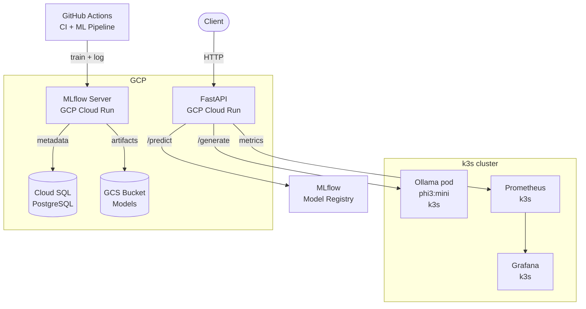
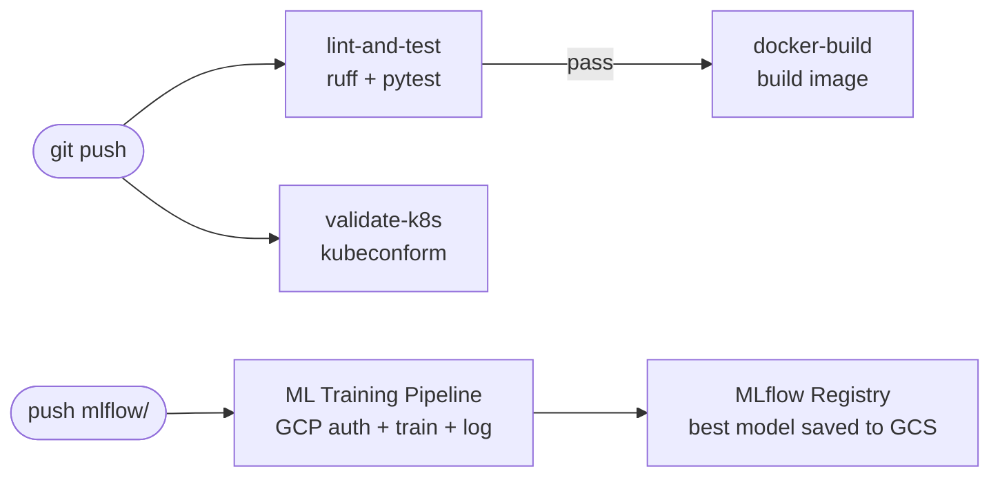

# ollama-k8s-mlops

> Full MLOps stack on Kubernetes + GCP — portfolio project

A production-style MLOps platform: LLM (Ollama/phi3:mini) on Kubernetes (k3s), FastAPI REST service on GCP Cloud Run, MLflow experiment tracking on Cloud Run with PostgreSQL + GCS backend, Prometheus/Grafana monitoring, and GitHub Actions CI/CD + ML training pipelines.

**Live demo:** https://fastapi-mlops-798191602372.europe-central2.run.app/docs  
**MLflow UI:** protected — requires GCP auth (see access instructions below)

---

## Architecture



---

## Stack

| Component | Technology | Where |
|-----------|-----------|-------|
| LLM runtime | Ollama + phi3:mini | Kubernetes k3s |
| API wrapper | Python FastAPI | k3s + GCP Cloud Run |
| ML tracking | MLflow 3.x | GCP Cloud Run |
| ML database | PostgreSQL | GCP Cloud SQL |
| ML artifacts | Models + metrics | GCP Cloud Storage |
| Credentials | Secrets | GCP Secret Manager |
| Monitoring | Prometheus + Grafana | Kubernetes k3s |
| Ingress | Traefik | Kubernetes k3s |
| Storage | PersistentVolumeClaim 10Gi | Kubernetes k3s |
| CI/CD | GitHub Actions | GitHub |

---

## API Endpoints

| Method | Endpoint | Description |
|--------|----------|-------------|
| GET | `/` | Service info |
| GET | `/health` | Health check + Ollama status |
| POST | `/generate` | LLM text generation via Ollama |
| POST | `/predict` | Material classification via MLflow model |
| GET | `/predict/classes` | Available classes + feature info |
| GET | `/metrics` | Prometheus metrics |
| GET | `/docs` | Swagger UI |

### Example: LLM generation

```bash
curl -s https://fastapi-mlops-798191602372.europe-central2.run.app/generate \
  -H "Content-Type: application/json" \
  -d '{"prompt":"What is MLOps?","model":"phi3:mini"}' \
  | python3 -m json.tool
```

### Example: Material classification

```bash
# Features: [texture, reflectivity, weight, hardness, conductivity] — values 0.0 to 1.0
curl -s https://fastapi-mlops-798191602372.europe-central2.run.app/predict \
  -H "Content-Type: application/json" \
  -d '{"features": [0.1, 0.9, 0.8, 0.9, 0.95]}' \
  | python3 -m json.tool
# Returns: {"material": "metal", "confidence": 0.99, ...}
```

---

## Quick Start — Local (k3s)

### Prerequisites

- WSL2 Ubuntu 24.04
- Docker
- k3s
- kubectl + helm

### Deploy Ollama + FastAPI

```bash
# 1. Create namespace
kubectl create namespace mlops

# 2. Deploy Ollama
kubectl apply -f k8s/ollama/

# 3. Pull LLM model
POD=$(kubectl get pod -n mlops -l app=ollama \
  -o jsonpath='{.items[0].metadata.name}')
kubectl exec -it $POD -n mlops -- ollama pull phi3:mini

# 4. Build and import FastAPI image
docker build -t ollama-fastapi:v1.0 ./app
docker save ollama-fastapi:v1.0 | sudo k3s ctr images import -

# 5. Deploy FastAPI
kubectl apply -f k8s/fastapi/

# 6. Test
kubectl port-forward svc/fastapi-service 8000:8000 -n mlops
curl http://localhost:8000/health
```

### Deploy monitoring

```bash
helm repo add prometheus-community \
  https://prometheus-community.github.io/helm-charts
helm repo update

helm install monitoring \
  prometheus-community/kube-prometheus-stack \
  --namespace monitoring \
  --create-namespace \
  --set nodeExporter.enabled=false

kubectl apply -f k8s/monitoring/servicemonitor.yaml
```

---

## GCP Cloud Run Deployment

### FastAPI service

```bash
gcloud auth configure-docker europe-central2-docker.pkg.dev

docker build \
  -t europe-central2-docker.pkg.dev/ollama-mlops/mlops-repo/fastapi-cloudrun:v1.0 \
  ./cloudrun/

docker push \
  europe-central2-docker.pkg.dev/ollama-mlops/mlops-repo/fastapi-cloudrun:v1.0

gcloud run deploy fastapi-mlops \
  --image europe-central2-docker.pkg.dev/ollama-mlops/mlops-repo/fastapi-cloudrun:v1.0 \
  --platform managed \
  --region europe-central2 \
  --allow-unauthenticated \
  --port 8080 \
  --memory 512Mi
```

### MLflow tracking server

```bash
# Prerequisites: Cloud SQL PostgreSQL + GCS bucket + Secret Manager
docker build \
  -t europe-central2-docker.pkg.dev/ollama-mlops/mlops-repo/mlflow-server:v1.4 \
  ./mlflow/cloudrun/

docker push \
  europe-central2-docker.pkg.dev/ollama-mlops/mlops-repo/mlflow-server:v1.4

gcloud run deploy mlflow-server \
  --image europe-central2-docker.pkg.dev/ollama-mlops/mlops-repo/mlflow-server:v1.4 \
  --platform managed \
  --region europe-central2 \
  --service-account mlflow-runner@ollama-mlops.iam.gserviceaccount.com \
  --add-cloudsql-instances ollama-mlops:europe-central2:mlflow-db \
  --set-env-vars="MLFLOW_ARTIFACT_ROOT=gs://mlops-mlflow-artifacts-798191602372" \
  --set-secrets="MLFLOW_BACKEND_URI=mlflow-db-uri:latest" \
  --port 8080 \
  --memory 2Gi \
  --no-allow-unauthenticated
```

### Access MLflow UI

MLflow is deployed with `--no-allow-unauthenticated` for security — models and experiment data are not public.

```bash
# Option 1 — local proxy (recommended, opens at http://localhost:5001)
gcloud run services proxy mlflow-server \
  --region europe-central2 \
  --port 5001

# Option 2 — authenticated curl
TOKEN=$(gcloud auth print-identity-token)
curl -H "Authorization: Bearer $TOKEN" \
  https://mlflow-server-798191602372.europe-central2.run.app/health
```

### Run ML experiments

```bash
export MLFLOW_TRACKING_URI="https://mlflow-server-798191602372.europe-central2.run.app"
export MLFLOW_TRACKING_TOKEN=$(gcloud auth print-identity-token)

python3 mlflow/experiments/train_classifier.py
```

---

## CI/CD Pipelines



### GitHub Actions secrets required

| Secret | Description |
|--------|-------------|
| `GCP_SA_KEY` | Service account JSON key with Cloud Run + GCS + Cloud SQL access |
| `MLFLOW_TRACKING_URI` | MLflow Cloud Run service URL |

---

## Project Structure

```
ollama-k8s-mlops/
├── app/
│   ├── main.py              # FastAPI — /generate, /predict, /health, /metrics
│   ├── model_serving.py     # MLflow model loader for /predict endpoint
│   ├── requirements.txt
│   ├── Dockerfile
│   └── tests/
│       └── test_main.py     # pytest unit tests (5/5 passing)
├── cloudrun/
│   ├── main.py              # FastAPI for GCP Cloud Run
│   ├── requirements.txt
│   └── Dockerfile
├── mlflow/
│   ├── cloudrun/
│   │   ├── entrypoint.sh    # MLflow server startup script
│   │   └── Dockerfile
│   └── experiments/
│       └── train_classifier.py  # Material classification — 5 models
├── k8s/
│   ├── ollama/
│   │   ├── deployment.yaml
│   │   ├── service.yaml
│   │   └── pvc.yaml
│   ├── fastapi/
│   │   ├── deployment.yaml
│   │   ├── service.yaml
│   │   └── ingress.yaml
│   └── monitoring/
│       ├── values.yaml
│       └── servicemonitor.yaml
└── .github/
    └── workflows/
        ├── ci.yaml           # CI: lint, test, docker build, k8s validate
        └── ml-pipeline.yaml  # ML: GCP auth + train + log to MLflow
```

---

## Skills Demonstrated

- **Kubernetes** — Deployments, Services, Ingress (Traefik), PVC, health probes, Helm, ServiceMonitor
- **MLOps** — MLflow experiment tracking, model registry, GCS artifact storage, model serving
- **GCP** — Cloud Run, Artifact Registry, Cloud SQL (PostgreSQL), Cloud Storage, Secret Manager, IAM
- **Python** — FastAPI, async HTTP (httpx), Prometheus instrumentation, scikit-learn, MLflow client
- **Docker** — Non-root user, health checks, entrypoint scripts, multi-service containerization
- **Monitoring** — Prometheus, Grafana, kube-prometheus-stack, ServiceMonitor, custom dashboards
- **CI/CD** — GitHub Actions: ruff linting, pytest, Docker build, kubeconform validation, ML pipeline

---

## Author

vikpl21@gmail.com — [GitHub](https://github.com/vikpl21)
