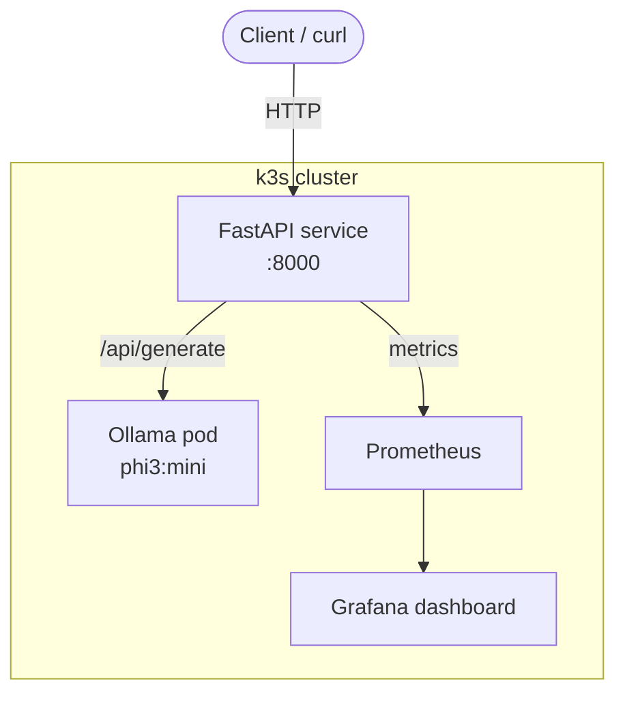
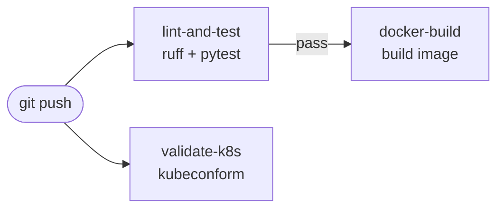

# ollama-k8s-mlops

> LLM deployment on Kubernetes — MLOps portfolio project

A production-style MLOps stack running a local LLM (Ollama + phi3:mini) on Kubernetes (k3s), wrapped with a FastAPI service exposing REST endpoints with Prometheus metrics.

## Architecture



## Stack

| Component | Technology |
|-----------|-----------|
| LLM runtime | Ollama + phi3:mini |
| API wrapper | Python FastAPI |
| Container runtime | Docker |
| Orchestration | Kubernetes k3s |
| Ingress | Traefik |
| Metrics | Prometheus + Grafana |
| Storage | PersistentVolumeClaim 10Gi |
| CI/CD | GitHub Actions |

## API Endpoints

| Method | Endpoint | Description |
|--------|----------|-------------|
| GET | `/` | Service info |
| GET | `/health` | Health check + Ollama status |
| POST | `/generate` | LLM text generation |
| GET | `/metrics` | Prometheus metrics |
| GET | `/docs` | Swagger UI |

## Quick Start

### Prerequisites

- WSL2 Ubuntu 24.04
- Docker
- k3s
- kubectl + helm

### Deploy

```bash
# 1. Create namespace
kubectl create namespace mlops

# 2. Deploy Ollama
kubectl apply -f k8s/ollama/

# 3. Pull LLM model
POD=$(kubectl get pod -n mlops -l app=ollama \
  -o jsonpath='{.items[0].metadata.name}')
kubectl exec -it $POD -n mlops -- ollama pull phi3:mini

# 4. Build and import FastAPI image
docker build -t ollama-fastapi:v1.0 ./app
docker save ollama-fastapi:v1.0 | sudo k3s ctr images import -

# 5. Deploy FastAPI
kubectl apply -f k8s/fastapi/

# 6. Test
kubectl port-forward svc/fastapi-service 8000:8000 -n mlops
curl http://localhost:8000/health
```

### Generate text

```bash
curl -s http://localhost:8000/generate \
  -H "Content-Type: application/json" \
  -d '{"prompt":"What is MLOps?","model":"phi3:mini"}' \
  | python3 -m json.tool
```

### Deploy monitoring

```bash
helm repo add prometheus-community \
  https://prometheus-community.github.io/helm-charts
helm repo update

helm install monitoring \
  prometheus-community/kube-prometheus-stack \
  --namespace monitoring \
  --create-namespace \
  --set nodeExporter.enabled=false

kubectl apply -f k8s/monitoring/servicemonitor.yaml
```

```text
## Project Structure
ollama-k8s-mlops/
├── app/
│   ├── main.py              # FastAPI application
│   ├── requirements.txt     # Python dependencies
│   ├── Dockerfile           # Container build
│   └── tests/
│       └── test_main.py     # pytest unit tests
├── k8s/
│   ├── ollama/
│   │   ├── deployment.yaml
│   │   ├── service.yaml
│   │   └── pvc.yaml
│   ├── fastapi/
│   │   ├── deployment.yaml
│   │   ├── service.yaml
│   │   └── ingress.yaml
│   └── monitoring/
│       ├── values.yaml
│       └── servicemonitor.yaml
└── .github/
└── workflows/
└── ci.yaml          # CI: lint, test, build, validate
```

## CI/CD Pipeline




## Author

[vikpl21@gmail.com](mailto:vikpl21@gmail.com) — [GitHub](https://github.com/vikpl21)
